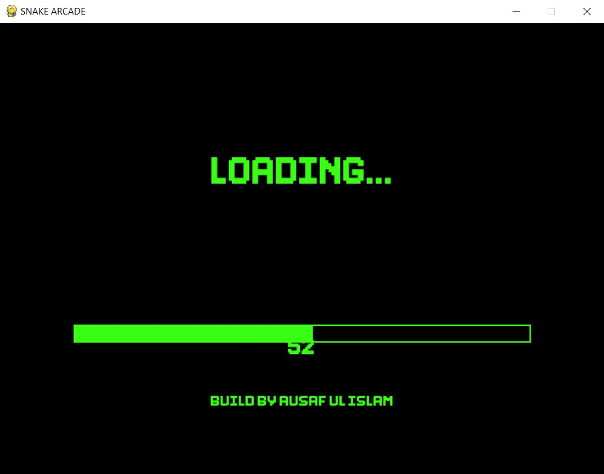
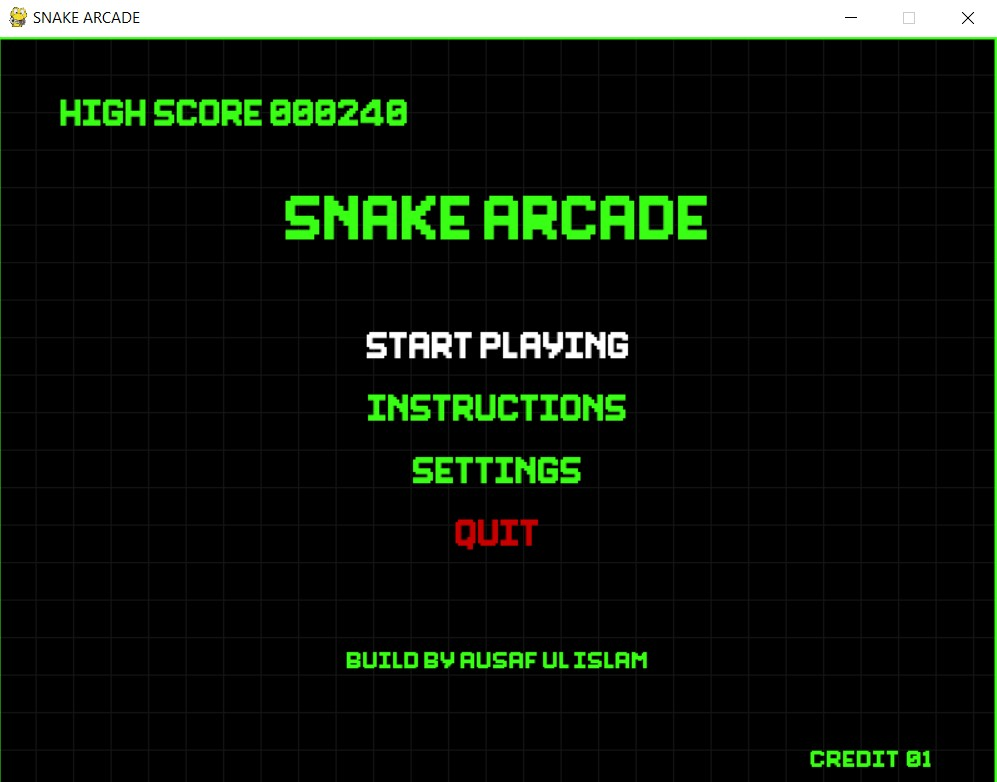
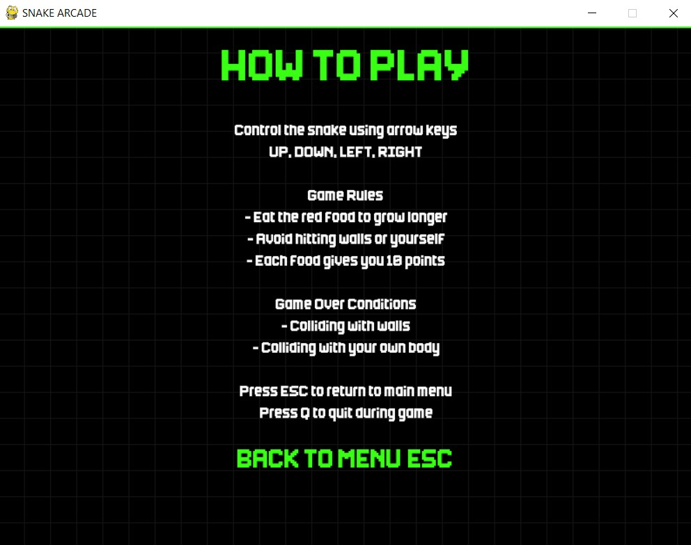
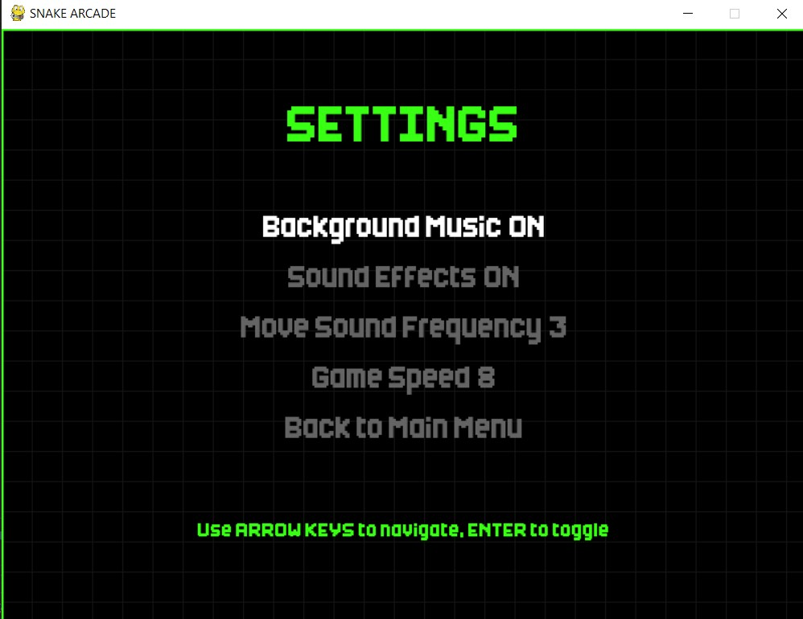
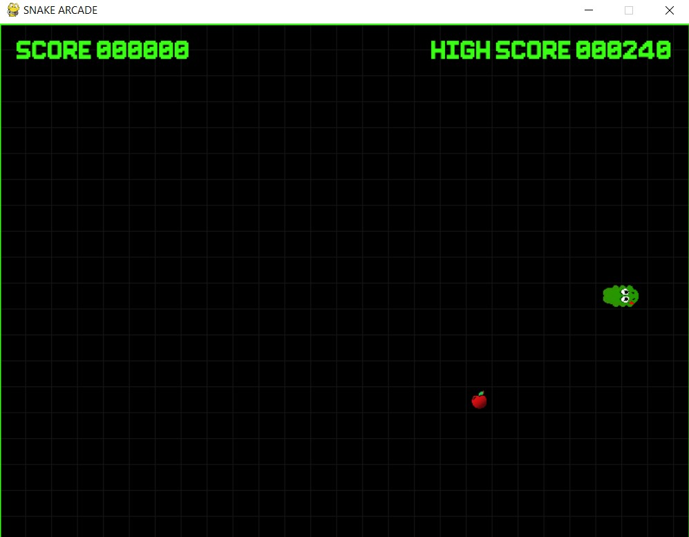
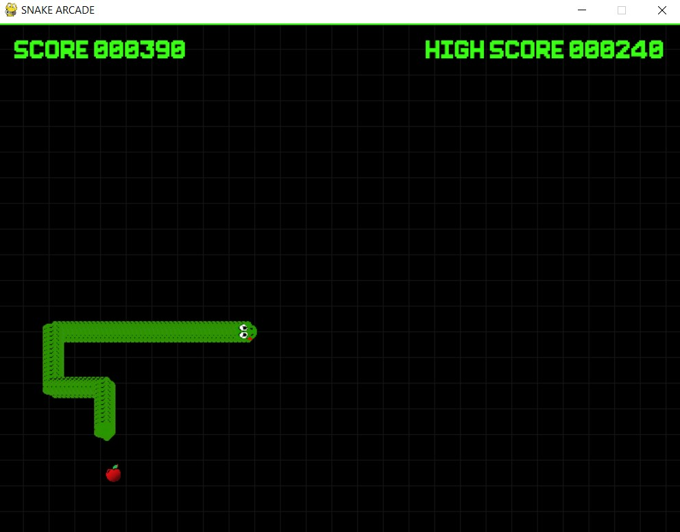
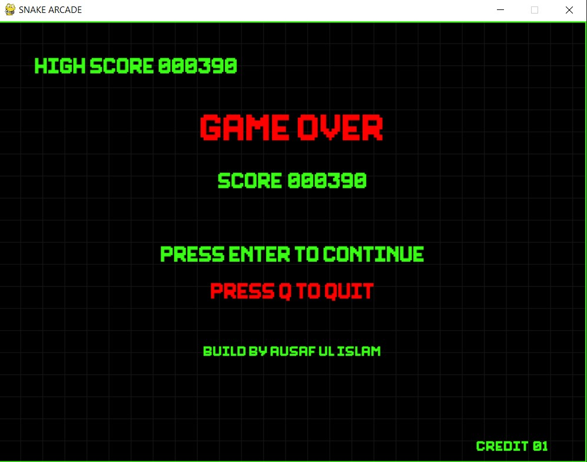

# 🐍 Python Games Collection

A growing collection of engaging games developed using Python.

[](https://github.com/ausafulislam/Python_Games) [](https://github.com/ausafulislam/Python_Games/stargazers) [](https://github.com/ausafulislam/Python_Games/network/members)

### 🎮 Game Previews

<div align="center">
  
  
  
  <br/>
  
  
  
  <br/>
  
</div>

## ✨ Features

- 🐍 **Classic Snake Game:** Relive the arcade classic with intuitive controls and engaging gameplay.
- ✨ **Modular Design:** Each game is developed as a standalone module, making it easy to understand and extend.
- 💻 **Pure Python Implementation:** All games are built using standard Python libraries, ensuring broad compatibility.
- 🚀 **Expandable Collection:** Designed to easily integrate new game projects as the repository grows.
- 🌟 **Beginner-Friendly Codebase:** Well-commented and structured code, ideal for Python learners and enthusiasts.

## 🚀 Installation

To get a local copy up and running, follow these simple steps.

### Prerequisites

Ensure you have Python installed on your system. This project is developed with Python 3.x.

- Python 3.x
  ```bash
  python --version
  ```

### Manual Installation

1.  **Clone the repository:**
    ```bash
    git clone https://github.com/ausafulislam/Python_Games.git
    ```
2.  **Navigate into the project directory:**
    ```bash
    cd Python_Games
    ```
3.  **Create a virtual environment (recommended):**
    ```bash
    python -m venv venv
    ```
4.  **Activate the virtual environment:**
    - On Windows:
      ```bash
      .\venv\Scripts\activate
      ```
    - On macOS/Linux:
      ```bash
      source venv/bin/activate
      ```
5.  **Install project dependencies:**
    The `snake_game` requires `pygame`.
    ```bash
    pip install pygame
    ```

## 🎮 Usage

Once the installation is complete, you can run the games from the command line.

### Running the Snake Game

To play the classic Snake game:

```bash
python snake_game/main.py
```


## 🤝 Contributing

Contributions are what make the open-source community such an amazing place to learn, inspire, and create. Any contributions you make are **greatly appreciated**.

If you have a suggestion that would make this better, please fork the repo and create a pull request. You can also simply open an issue with the tag "enhancement".

1.  **Fork the Project**
2.  **Create your Feature Branch:**
    ```bash
    git checkout -b feature/AmazingFeature
    ```
3.  **Commit your Changes:** Write clear, concise commit messages.
    ```bash
    git commit -m 'Add some AmazingFeature'
    ```
4.  **Push to the Branch:**
    ```bash
    git push origin feature/AmazingFeature
    ```
5.  **Open a Pull Request:** Describe your changes thoroughly.

### Testing

Before submitting a pull request, please ensure your code runs locally without errors and that any new features are thoroughly tested.

## 📄 License

This project is currently **not licensed**. This means that, by default, all rights are reserved by the copyright holder (`ausafulislam`). You may not distribute, modify, or use this software for any purpose without explicit permission.

For inquiries regarding licensing or usage, please contact the main contributor, `ausafulislam`.

---

Made with ❤️ by `ausafulislam`
